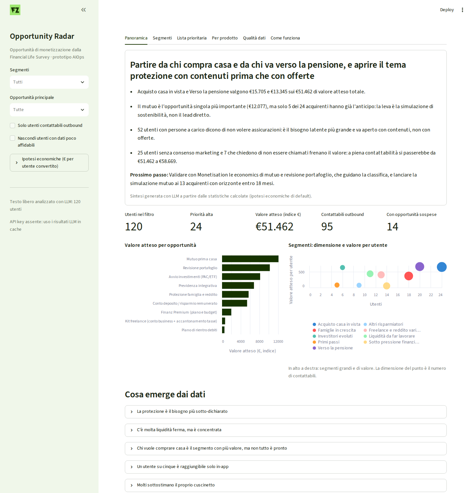
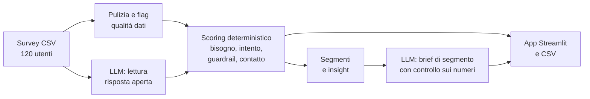

# Finanz Opportunity Radar

Prototipo interno per i team Product e Monetisation: prende le risposte alla Financial Life Survey e dice su quali utenti conviene lavorare, con quale prodotto, su quale canale e perché.



Altre schermate: [segmenti](docs/02_segmenti.png), [lista prioritaria](docs/03_lista.png), [vista per prodotto](docs/04_prodotto.png).

## Avvio rapido

Serve Python 3.10 o superiore.

```bash
python -m venv .venv
source .venv/bin/activate        # su Windows: .venv\Scripts\activate
pip install -r requirements.txt
streamlit run app.py
```

Non serve una API key: i risultati dell'LLM sono già in `data/llm_cache/` (vedi sotto). Altri comandi utili:

```bash
python run_pipeline.py                 # rigenera gli output in outputs/ (CSV e JSON)
python run_pipeline.py --refresh-llm   # rifà le chiamate LLM, serve ANTHROPIC_API_KEY
pytest -q                              # test sulle regole principali
```

Se non si vuole installare niente, in `outputs/` ci sono già la lista prioritaria (`priority_list.csv`), tutte le coppie utente-opportunità con le evidenze (`all_opportunities.csv`), le anomalie nei dati, i segmenti con i loro brief e gli insight.

## Cosa ho costruito

Ho interpretato "opportunità" come una coppia concreta **utente × cosa Finanz può vendergli**, dove il "cosa" è un catalogo di 9 leve legate ai due modelli di ricavo del brief:

- **Partner:** mutuo, revisione di portafoglio, avvio investimenti con PAC, previdenza integrativa, protezione, kit freelance e conto deposito.
- **Abbonamento:** piano di rientro debiti e Finanz Premium.

Un'opportunità astratta tipo "il segmento famiglie è interessante" non si può mettere in una campagna; una lista di utenti con prodotto, canale e motivazione sì. I segmenti restano, ma come modo di leggere e aggregare le opportunità.

L'app Streamlit ha sei schede, pensate sulle domande del brief:

- **Panoramica:** sintesi, valore per opportunità, mappa dei segmenti e sei insight dai dati. Risponde a "quali pattern meritano attenzione".
- **Segmenti:** per ogni segmento numeri, brief scritto dall'LLM con azioni suggerite e lista utenti. Risponde a "quali segmenti sono interessanti e cosa facciamo".
- **Lista prioritaria:** un'opportunità principale per utente, ordinata, filtrabile ed esportabile in CSV. Il dettaglio utente mostra profilo, risposta aperta, tutte le opportunità con i punteggi e le evidenze.
- **Per prodotto:** per chi deve costruire una campagna su un prodotto specifico. Mostra tutti gli eleggibili, non solo quelli per cui è l'opportunità principale.
- **Qualità dati:** anomalie e contraddizioni trovate.
- **Come funziona:** il metodo in breve.

Dalla barra laterale si possono cambiare le ipotesi economiche per prodotto e la classifica si ricalcola subito. L'ho fatto perché è l'ipotesi più fragile di tutto il sistema, e mi sembrava giusto che chi conosce i numeri veri potesse metterli.

## Come funziona



1. **Pulizia e feature.** Nessuna riga viene scartata. I redditi mancanti (13) vengono stimati dalla mediana per tipo di contratto e fascia d'età, la liquidità mancante (4) dai mesi di fondo emergenza dichiarati. Tutto ciò che è stimato viene marcato. Calcolo spese mensili stimate, liquidità oltre un cuscinetto di sicurezza, mutuo sostenibile e copertura dell'anticipo, e un indicatore di pressione finanziaria.
2. **Lettura del testo libero con LLM.** Vedi la sezione successiva.
3. **Qualità dati.** Regole sulle contraddizioni tra campi strutturati, per esempio "figlio appena nato" con zero persone a carico, oppure persone a carico pari al numero di componenti del nucleo. A queste si aggiunge il confronto tra quello che l'utente scrive e quello che ha compilato. Le anomalie abbassano la confidenza della raccomandazione (alta, media o bassa).
4. **Scoring deterministico.** Per ogni coppia utente-opportunità calcolo quattro elementi:
   - **Bisogno:** quanto la situazione la rende rilevante.
   - **Intento:** interesse dichiarato, obiettivo principale, testo, evento di vita recente, apertura a una call.
   - **Guardrail:** quando proporla sarebbe contro l'interesse dell'utente.
   - **Raggiungibilità:** consenso marketing e preferenze di contatto.

   Da questi deriva il valore atteso:

   `valore atteso = valore base × fattore dimensione × propensione × raggiungibilità × confidenza`

   dove `propensione = 0,6 × intento + 0,4 × bisogno`. Ogni punteggio porta con sé la lista delle evidenze che lo hanno generato, ed è quella che si vede nell'app.
5. **Segmenti e insight.** I segmenti sono 9 regole leggibili applicate in ordine (first match). Gli insight sono conteggi e rapporti calcolati.

Tutto quello che è un'ipotesi di business (pesi, soglie, valori economici, trigger degli eventi di vita) sta in `radar/config.py`.

## Dove uso l'AI, dove no, e perché

**Lettura della risposta aperta** (`radar/text_signals.py`). L'LLM trasforma "In cosa vorresti ricevere aiuto?" in dati strutturati:
- bisogni dentro una tassonomia chiusa di 13 codici;
- il bisogno principale;
- vincoli di contatto;
- fatti che l'utente afferma di sé (freelance, figli, "tutto in liquidità"…);
- una sintesi breve.

Qui le regole si rompono, per tre motivi:
- **Lingue:** in produzione le risposte saranno in italiano, spagnolo e francese.
- **Negazioni e sequenze:** "voglio ridurre le rate prima di pensare a investire" contiene la parola investire ma non è un bisogno di investimento.
- **Vincoli di contatto:** alcune informazioni esistono solo nel testo. 7 utenti danno il consenso marketing ma scrivono che non vogliono essere chiamati per prodotti, e questo cambia il canale.

L'LLM vede solo il testo, non i dati finanziari, e non decide nulla: l'output viene validato (le etichette fuori tassonomia vengono scartate) e poi usato da regole deterministiche. I testi vengono deduplicati prima della chiamata (33 unici su 120 utenti).

**Brief di segmento e sintesi** (`radar/briefs.py`). L'LLM trasforma le statistiche di ogni segmento in un testo breve con azioni suggerite, coerenti con il catalogo e con i guardrail. Vede solo aggregati già calcolati. Dopo la generazione un controllo verifica che ogni numero citato esista nelle statistiche; se no, l'app mostra un avviso. Un template avrebbe prodotto frasi sempre uguali; qui il valore è scegliere cosa conta per quel segmento.

**Dove non la uso.** Scoring, segmenti, guardrail e insight sono deterministici, per quattro ragioni:
- **Auditabilità:** in un contesto finanziario devo poter spiegare perché a un utente è stato proposto un mutuo, e ripetere lo stesso risultato domani.
- **Precisione:** i conteggi devono essere esatti.
- **Numeri piccoli:** con 120 utenti un modello non ha niente da imparare.
- **Costo:** una regola non costa nulla da eseguire.

Non ho usato clustering per i segmenti per lo stesso motivo: "cluster 3" non dice niente a un PM.

**Nota sulla cache LLM.** Durante lo sviluppo non avevo una API key. I risultati versionati in `data/llm_cache/` li ho quindi generati con Claude applicando gli stessi prompt che si trovano nel codice, e nel file sono marcati come "bootstrap manuale". La pipeline li riusa se li trova. Con `ANTHROPIC_API_KEY` impostata e `--refresh-llm` li rigenera via API, con Haiku per l'estrazione e Sonnet per i brief, modificabili via variabili d'ambiente. Se manca sia la cache sia la chiave, c'è un fallback a keyword (solo inglese, marcato come tale nell'app) per non bloccare la pipeline.

## Assunzioni principali

- **Valori economici inventati.** Il valore base per prodotto (€700 per un mutuo, €70 per un conto deposito…) è un segnaposto: non conosco CPA, trail e prezzo dell'abbonamento di Finanz. Il valore atteso è quindi un indice per ordinare, non una previsione di ricavo.
- **L'intento pesa più del bisogno (60/40).** Un prodotto che l'utente non riconosce come utile converte poco. La conseguenza è che i bisogni latenti, come la protezione per chi ha figli e dice di non volere assicurazioni, finiscono più in basso e con un'azione educativa invece che commerciale.
- **Contatto.** Senza consenso marketing propongo solo contenuti in-app. Se il testo dice "non chiamatemi", vince sul campo strutturato.
- **Guardrail.** A chi è sotto pressione finanziaria propongo solo il piano di rientro, Premium e il conto deposito, e non propongo mai prodotti di credito, nemmeno il consolidamento. Le soglie: risparmio nullo o negativo, debito al consumo sopra il 40% del reddito annuo, oppure fondo emergenza di al massimo 1 mese con debiti aperti. Gli investimenti sono sospesi anche senza fondo emergenza, o con debito su carta di credito che la liquidità non basta a chiudere.
- **Stime finanziarie grezze.** Il survey non chiede le spese, quindi le stimo come reddito meno risparmio. Il cuscinetto target è di 4 mesi, oppure 6 per autonomi, tempo determinato e reddito instabile. Il mutuo sostenibile assume una rata al 30% del reddito netto, 25 anni al 3,5% circa, LTV 80% e costi d'acquisto al 5%.
- **Nessuna differenza per paese.** Italia, Spagna e Francia hanno regole molto diverse su previdenza e mutui; qui è tutto uguale.
- **Data di riferimento fissa (22/09/2026).** 11 survey risultano compilati dopo questa data e vengono segnalati. Uso una data fissa e non "oggi" perché altrimenti i risultati cambierebbero a seconda di quando si esegue la pipeline.

## Il limite più importante

La classifica dipende da pesi e valori economici scelti da me, non appresi da dati di conversione. Con i valori di default le 24 priorità alte sono tutte mutui (15) e revisioni di portafoglio (9). Se il mutuo vale €200 invece di €700, nessun mutuo resta tra le priorità alte. Il sistema è trasparente su perché ordina così, ma non sa se ordina bene. Serve un pilota su un segmento con esiti tracciati per calibrare pesi e valori.

C'è anche un limite specifico di questo dataset: le risposte aperte sono molto ripetitive (33 frasi distinte su 120 utenti), quindi il contributo dell'LLM qui è più piccolo di quanto sarebbe su testi reali.

## Cosa ho lasciato fuori

- **Economics per paese e per partner:** non ho i dati per costruirle.
- **Integrazione con CRM o esportazione verso strumenti di campagna:** la lista esce in CSV.
- **Valutazione quantitativa dell'estrazione LLM:** manca un set etichettato, e sarebbe la prima cosa da costruire con testi veri.
- **Design dell'app:** default di Streamlit, con un tema leggero.

## Struttura

```
app.py                 interfaccia Streamlit
run_pipeline.py        CLI: esegue la pipeline e scrive outputs/
radar/
  config.py            catalogo opportunità, pesi, soglie, ipotesi economiche
  clean.py             pulizia, feature derivate, flag di qualità dei dati
  text_signals.py      estrazione LLM dal testo libero + confronto testo/dati
  scoring.py           bisogno, intento, guardrail, valore atteso, evidenze
  segments.py          segmenti a regole e statistiche per segmento
  insights.py          insight deterministici
  briefs.py            brief e sintesi LLM con controllo sui numeri
  llm.py               client Anthropic + cache JSON
  pipeline.py          orchestrazione
data/
  finanz_financial_life_survey.csv
  llm_cache/           risultati LLM versionati
outputs/               risultati pronti da aprire
tests/                 test sulle regole principali
FOLLOWUP.md            risposte al follow-up scritto
docs/                  screenshot dell'app
assets/                logo Finanz usato nell'app
```
